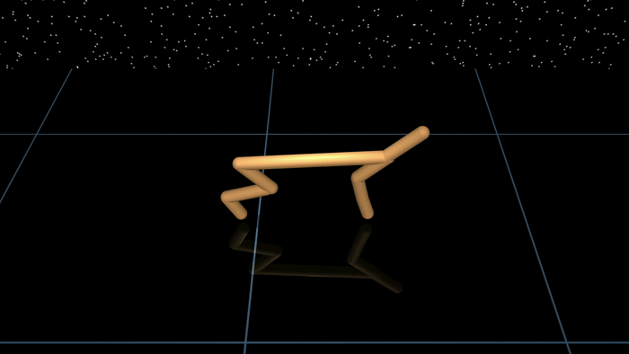

# Random Search
A simple [JAX](https://github.com/google/jax)-based implementation of [random search](https://arxiv.org/abs/1803.07055) for [locomotion tasks](https://github.com/openai/gym/tree/master/gym/envs/mujoco) using [MuJoCo XLA (MJX)](https://mujoco.readthedocs.io/en/stable/mjx.html).

## Installation
Clone the repository:
```sh
git clone https://github.com/thowell/rs
```

Optionally, create a conda environment:
```sh
conda create -n rs python=3.10
conda activate rs
```

pip install:
```sh
pip install -e .
```

## Train cheetah
Train cheetah in ~1 minute with [Nvidia RTX 4090](https://www.nvidia.com/en-us/geforce/graphics-cards/40-series/rtx-4090/) on [Ubuntu 22.04.4 LTS](https://releases.ubuntu.com/jammy/).



Run:
```sh
python rs/train.py --env cheetah --search --visualize --nsample 2048 --ntop 512 --niter 50 --neval 5 --nhorizon_search 200 --nhorizon_eval 1000 --random_step 0.1 --update_step 0.1
```

Output:
```
Settings:
 environment: cheetah
  nsample: 2048 | ntop: 512
  niter: 50 | neval: 5
  nhorizon_search: 200 | nhorizon_eval: 1000
  random_step: 0.1 | update_step: 0.1
  nenveval: 128
  reward_shift: 0.0
Search:
iteration (10 / 50): reward = 1172.42 +- 1144.11 | time = 17.52 | avg episode length: 1000 / 1000 | global steps: 8232960 | steps/second: 470022
iteration (20 / 50): reward = 2947.71 +- 1237.87 | time = 5.58 | avg episode length: 1000 / 1000 | global steps: 16465920 | steps/second: 1474670
iteration (30 / 50): reward = 3152.07 +- 1401.50 | time = 5.58 | avg episode length: 1000 / 1000 | global steps: 24698880 | steps/second: 1475961
iteration (40 / 50): reward = 4175.49 +- 783.41 | time = 5.59 | avg episode length: 1000 / 1000 | global steps: 32931840 | steps/second: 1472244
iteration (50 / 50): reward = 4293.36 +- 784.80 | time = 5.59 | avg episode length: 1000 / 1000 | global steps: 41164800 | steps/second: 1473380

total time: 56.43
```

The pretrained policy can be visualized in MuJoCo's passive viewer:
```
python train.py --env cheetah --load pretrained/cheetah --visualize
```

## Environments
Environments available:

- [Ant](rs/envs/ant.py)
  - based on [ant_v5](https://github.com/Farama-Foundation/Gymnasium/blob/main/gymnasium/envs/mujoco/ant_v5.py)
  - modified solver settings
  - only contact between feet and floor
  - no rewards or observations dependent on contact forces
- [Cheetah](rs/envs/cheetah.py)
  - based on [half_cheetah_v5](https://github.com/Farama-Foundation/Gymnasium/blob/main/gymnasium/envs/mujoco/half_cheetah_v5.py)
  - modified solver settings
- [Humanoid](rs/envs/humanoid.py)
  - based on [humanoid_v5](https://github.com/Farama-Foundation/Gymnasium/blob/main/gymnasium/envs/mujoco/humanoid_v5.py)
  - modified solver settings
  - only contact between feet and floor
  - no rewards or observations dependent on contact forces
- [Walker](rs/envs/walker.py)
  - based on [walker2d_v5](https://github.com/Farama-Foundation/Gymnasium/blob/main/gymnasium/envs/mujoco/walker2d_v5.py)
  - modified solver settings
  - only contact between feet and floor


## Usage
**Note**: run multiple times to find good policies.

First, change to `rs/` directory:
```sh
cd rs
```

### Ant
Search:
```sh
python train.py --env ant --search
```

Visualize policy checkpoint:
```sh
python train.py --env ant --mode visualize --load pretrained/ant
```

### Cheetah
Search:
```sh
python train.py --env cheetah --search
```

Visualize policy checkpoint:
```sh
python train.py --env cheetah --load pretrained/cheetah --visualize
```

### Humanoid
Search:
```sh
python train.py --env humanoid --search
```

Visualize policy checkpoint:
```sh
python train.py --env humanoid --load pretrained/humanoid --visualize
```

### Walker
Search:
```sh
python train.py --env walker --search
```

Visualize policy checkpoint:
```sh
python train.py --env walker --load pretrained/walker --visualize
```

### Command line arguments
Setup:
- `--env`: `ant`, `cheetah`, `humanoid`, `walker`
- `--search`: run random search to improve policy
- `--checkpoint`: filename in `checkpoint/` to save policy
- `--load`: provide string in `checkpoint/` 
directory to load policy from checkpoint
- `--seed`: int for random number generation
- `--visualize`: visualize policy 

Search settings:
- `--nsample`: number of random directions to sample
- `--ntop`: number of random directions to use for policy update
- `--niter`: number of policy updates
- `--neval`: number of policy evaluations during search
- `--nhorizon_search`: number of environment steps during policy improvement
- `--nhorizon_eval`: number of environment steps during policy evaluation
- `--random_step`: step size for random direction during policy perturbation
- `--update_step`: step size for policy update during policy improvement
- `--nenveval`: number of environments for policy evaluation
- `--reward_shift`: subtract baseline from per-timestep reward

## Mapping notation from the paper to code
$\alpha$: `update_step`

$\nu$: `random_step`

$N$: `nsample`

$b$: `ntop`

## Notes
